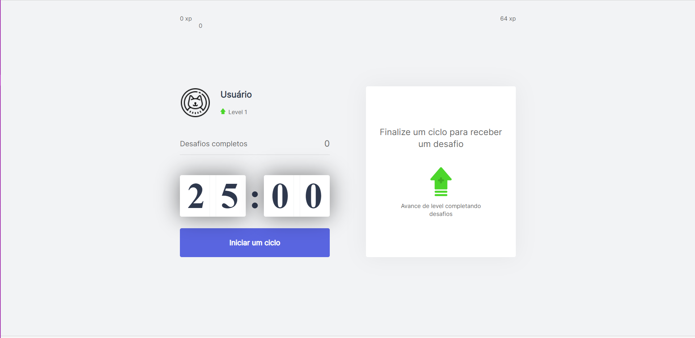

# moveIT
Projeto desenvolvido ao longo da NLW#4, hospedada em https://moveit-steel-ten.vercel.app/

## Sobre
O aplicativo é uma aplicação da técnica de pomodoro, num intervalo de 25 minutos. Ao final de cada ciclo, um desafio surgirá. 
Cada desafio são exercícios para manutenção do bem estar do corpo. Ao completar um desafio, você ganhará'XP, fazendo com que você suba de nível.
A aplicação armazena seus dados com cookies.

## Como rodar localmente
- Crie uma nova pasta dentro do seu PC.
- Abra algum terminal dentro da pasta.
- Digite "git clone https://github.com/richardrguinther/moveIT" (sem aspas)
- Digite "npm update"
- Novamente, insira "npm run dev"
- No seu navegador, acesse: "http://localhost:3000"

## Próximos passos da aplicação
- Sistema de login
- Customização de tempo de cada ciclo
- Customização da aplicação
- PWA
